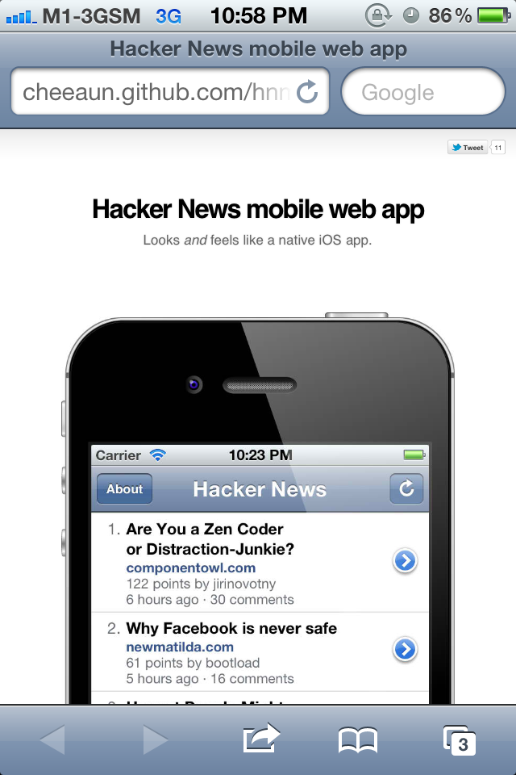
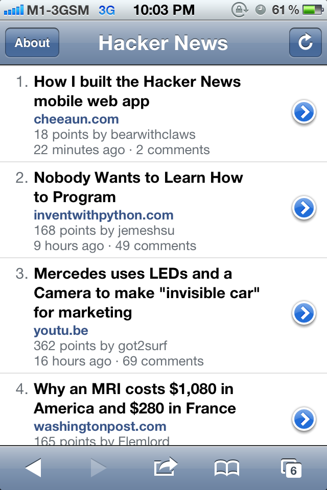
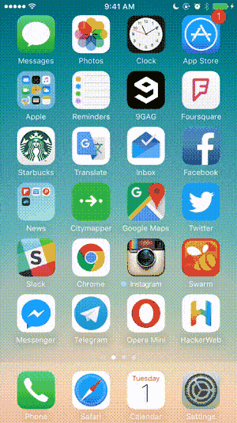

HackerWeb for iOS
===

A simply readable Hacker News app for iOS.

Story
---

On June 2011, I [made a statement](https://twitter.com/cheeaun/status/82464262156587008).

On October 2011, I [was playing around with some code](https://twitter.com/cheeaun/status/125548998118490112).

On Feb 2012, I [released HackerWeb](https://twitter.com/cheeaun/status/170127822818516993) (known as "HNmobile" at that time). I tried to coin the phrase "**Looks *and* feels like a native iOS app**" for the web app. I believe that HackerWeb is the first ever web app that tries to **seriously** cross the boundaries of native mobile apps.

On March 2012, I [wrote](https://twitter.com/cheeaun/status/176294093259948033) an [article on how I built it](http://cheeaun.com/blog/2012/03/how-i-built-hacker-news-mobile-web-app). It [got submitted](https://twitter.com/cheeaun/status/176301483866865664) to [Hacker News](https://news.ycombinator.com/item?id=3662709) and [appeared on the front page](https://twitter.com/cheeaun/status/176308046493003776).

Feedback has been amazing.

- > Behold @cheeaun 's very native looking Hacker News mobile web app. http://cheeaun.github.com/hnmobile/#/
>
> —[SengMin Tan (@sengming)](https://twitter.com/sengming/status/170390232670281728)

- > HN mobile web app http://cheeaun.github.com/hnmobile/landing/ … #hnmobile Now you tell me that a mobile web app can do everything a native app does... as easily!
>
> —[Sebastien Arbogast (@sarbogast)](https://twitter.com/sarbogast/status/176321258277978112)

- > Holy shit. A webapp that is better than a lot of native apps: http://cheeaun.github.com/hnmobile/#/
>
> —[Mitchell (@mitchell209)](https://twitter.com/mitchell209/status/176547385655296000)

- > Really impressed by @cheeaun's Hacker News mobile web app. Much better than any native clients/the full site on iOS.
>
> —[Nathan Clark (@nthnclrk)](https://twitter.com/nthnclrk/status/176991572578148355)

- > This is quite possibly the best iOS web app I've ever used, http://cheeaun.github.com/hnmobile/  it's almost perfect in every way I can think of…
>
> —[Philip (@philo23)](https://twitter.com/philo23/status/178031308042280960)

- > This web app feels snappier than every native HN app I've tried. You should give it a try too.
>
> —[Romain Ruetschi (@_romac)](https://twitter.com/_romac/status/181643344416481280)

- > This is THE BEST and ONLY useful way to read Hacker News on an iPhone or iPad. Bookmark.
>
> —[Scott Hanselman (@shanselman)](https://twitter.com/shanselman/status/234657758736158723)

Okay fine, I'll stop now.

Time goes by as I continue improving the app bit by bit. Since it's a web app, it auto-updates itself *quietly* and doesn't need uh... much announcements.

- On 26 March 2012, I wrote [a second article](https://cheeaun.com/blog/2012/03/how-i-built-hacker-news-mobile-web-app_26).
- On 2 June 2012, I made it [work for the iPad](https://twitter.com/cheeaun/status/208902768830853120).
- Around September 2012, I [updated the UI for iOS 6](https://twitter.com/cheeaun/status/249455647458988032).
- On 12 Dec 2012, I [renamed the app to HackerWeb](https://twitter.com/cheeaun/status/278876187634327553).
- On 21 January 2013, I [gave a talk](https://github.com/cheeaun/talks/tree/master/things-learnt-hackerweb).
- On 21 December 2013, I [updated the UI again for iOS 7](https://twitter.com/cheeaun/status/414423892707401728).

Okay I lied, more tweet reviews:

- > I use HackerWeb every day, best thing ever.
>
> —[Mario Ricalde (@mario_ricalde)](https://twitter.com/mario_ricalde/status/456159545769742336)

- > HackerWeb A simply readable Hacker News web app to bookmark on your mobile phone http://buff.ly/1tLaNwR  - and it's open source :)
>
> —[Jacob Shea (@JacobShea)](https://twitter.com/JacobShea/status/459769437328244736)

- > Have you guys seen HackerWeb? HackerNews reading pleasure (mobile included)
>
> —[Hugo Bessa (@hugoBessaa)](https://twitter.com/hugoBessaa/status/463476381603889153)

- > just discovered #hackerweb today, best mobile experience I've seen so far http://hackerwebapp.com/
>
> —[Vince Mi (@v_mi)](https://twitter.com/v_mi/status/488034079544049665)

Ever since HackerWeb is launched, there's been a few relevant articles and JS libraries popping up on the Internet:

- March 2012 - [Will HTML5 iPhone apps ever cross the Uncanny Valley of Native UI?](http://www.quora.com/Will-HTML5-iPhone-apps-ever-cross-the-Uncanny-Valley-of-Native-UI)
- September 2012 - [10 tips for getting that native iOS feel with PhoneGap](http://www.mikedellanoce.com/2012/09/10-tips-for-getting-that-native-ios.html)
- November 2012 - [Anatomy of a Native Feeling HTML5 iOS App](http://justinvincent.com/page/2043/anatomy-of-a-native-feeling-html5-ios-app)
- December 2012 - [The Making of Fastbook: An HTML5 Love Story](https://www.sencha.com/blog/the-making-of-fastbook-an-html5-love-story/)
- December 2012 - [Junior](http://justspamjustin.github.io/junior/)
- September 2013 - [Cloning the UI of iOS 7 with HTML, CSS and JavaScript](http://come.ninja/2013/cloning-the-ui-of-ios-7-with-html-css-and-javascript/)
- September 2013 - [A Beginner's Guide to Perceived Performance: 4 Ways to Make Your Mobile Site Feel Like a Native App](http://www.mobify.com/blog/beginners-guide-to-perceived-performance/)
- October 2013 - [Ionic Framework](http://ionicframework.com/)
- February 2014 - [Framework7](http://www.idangero.us/framework7/)
- January 2015 - [Native Web Apps](https://blog.andyet.com/2015/01/22/native-web-apps)

...and probably a few more which I've missed.

Obviously I'm quite obsessed with "native". When [React Native is announced on January 2015](https://www.youtube.com/watch?v=KVZ-P-ZI6W4), I was excited and a little sceptical. I tried it and wasn't satisfied with it. After [attending ReactEurope](https://twitter.com/cheeaun/status/596304731166744576) on July 2015, I become inspired again to try React Native and finally [this project comes alive](https://twitter.com/cheeaun/status/621679246944043008).

My previous attempt is to make a web app to look and feel like a native app. Now I have make a native app to look and feel like the web app!

So this is it. HackerWeb for iOS. Since 2011.

Preview
---

Development
---

### Requirements

- [React Native](https://facebook.github.io/react-native/)
- [Node.js](https://nodejs.org/) 4.0
- [Xcode](https://developer.apple.com/xcode/) 7
- [iOS](https://www.apple.com/ios/) **9**

### Getting started

- `npm install` - Install all dependencies

### Implementations

- [Alt](http://alt.js.org/) - the Flux thing
- [react-native-safari-view](https://github.com/naoufal/react-native-safari-view) - the reason why iOS 9 is the minimum requirement
- [react-native-activity-view](https://github.com/naoufal/react-native-activity-view) - for sharing links after long pressing
- [react-native-app-info](https://github.com/Iragne/react-native-app-info) - for displaying app version
- [htmlparser2](https://github.com/fb55/htmlparser2) - for parsing the comments HTML
- [url-parse](https://github.com/unshiftio/url-parse) - for extracting domains out of story URLs

### Bundling standalone modules

Some `npm` modules don't work with React Native so I have to compile them into a standalone module. Here's an example of the steps to bundle `htmlparser2`:

1. `npm install -g browserify` if not installed
2. `git clone https://github.com/fb55/htmlparser2`
3. `cd htmlparser2`
4. `npm install`
5. `browserify lib/index.js --standalone htmlparser2 > htmlparser2.js`
6. Move the generated `htmlparser2.js` file to the `vendor` folder in this repo

### Running on device (iOS)

This article has good documentation on this: [Running On Device (iOS)](https://facebook.github.io/react-native/docs/running-on-device-ios.html).

### Components

- `LoadingIndicator` - inspired by [react-native-activity-indicator-ios](https://github.com/pwmckenna/react-native-activity-indicator-ios)
- `HTMLView` - inspired by [react-native-htmlview](https://github.com/jsdf/react-native-htmlview), [react-native-htmltext](https://github.com/siuying/react-native-htmltext) and [react-native-html-render](https://github.com/soliury/react-native-html-render)
- `CacheStore` - inspired by [lscache](https://github.com/pamelafox/lscache)

Similar apps
---

- [HackerNews-React-Native](https://github.com/iSimar/HackerNews-React-Native)
- [ReactNativeHackerNews](https://github.com/jsdf/ReactNativeHackerNews)

License
---

[MIT](http://cheeaun.mit-license.org/).
